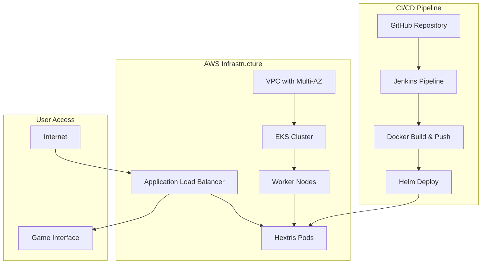

# 🎮 Hextris DevOps Deployment Pipeline

A complete DevOps implementation showcasing containerized deployment of the Hextris puzzle game using modern cloud-native technologies on AWS EKS.

## 📋 Table of Contents
- [Project Overview](#-project-overview)
- [Architecture](#-architecture)
- [Prerequisites](#-prerequisites)  
- [Quick Start](#-quick-start)
- [Detailed Setup](#-detailed-setup)
- [Configuration Guide](#-configuration-guide)
- [Deployment Options](#-deployment-options)
- [Monitoring & Troubleshooting](#-monitoring--troubleshooting)
- [Cleanup](#-cleanup)

---

## 🚀 Project Overview

This repository demonstrates a production-ready DevOps pipeline that deploys [Hextris](https://github.com/Hextris/hextris), an addictive puzzle game, using:

- **🐳 Docker** - Containerized nginx-based web application
- **☁️ AWS EKS** - Managed Kubernetes cluster with auto-scaling
- **🏗️ Terraform** - Infrastructure as Code for reproducible deployments  
- **⛵ Helm** - Kubernetes package management with best practices
- **🔄 Jenkins** - CI/CD automation with Kubernetes integration
- **🌐 AWS ALB** - Application Load Balancer for high availability

---

## 🏛️ Architecture



**Key Components:**
- **AWS VPC**: Multi-AZ network with public/private subnets
- **EKS Cluster**: Kubernetes 1.31 with managed node groups
- **ALB Controller**: Automatic load balancer provisioning
- **Helm Charts**: Production-ready Kubernetes manifests
- **Jenkins**: Automated CI/CD with Kubernetes agents

---

## ✅ Prerequisites

### Required Tools
```bash
# Core tools
docker --version          # >= 20.x
kubectl version --client  # >= 1.28
helm version              # >= 3.12
terraform --version       # >= 1.5
aws --version             # >= 2.x

# Optional for local testing
kind version              # >= 0.20
```

### AWS Requirements
- AWS Account with appropriate permissions
- AWS CLI configured with credentials
- IAM permissions for EKS, EC2, VPC, ALB creation

### System Requirements
- **OS**: Linux, macOS, or WSL2 on Windows
- **Memory**: 4GB+ available RAM
- **Storage**: 5GB+ free disk space

---

## 🚀 Quick Start

### 1. Clone and Setup
```bash
git clone <your-repo-url>
cd hextris-devops
```

### 2. Deploy Infrastructure
```bash
cd terraform-eks
terraform init
terraform plan
terraform apply -auto-approve
```

### 3. Configure Kubernetes
```bash
aws eks update-kubeconfig --region eu-west-1 --name my-eks-cluster
kubectl get nodes
```

### 4. Deploy Application
```bash
cd ../
helm upgrade --install hextris ./helm/hextris
kubectl get ingress
```

### 5. Access Application
```bash
# Get load balancer URL
kubectl get ingress hextris-hextris -o jsonpath='{.status.loadBalancer.ingress[0].hostname}'

# Or use port-forward for immediate access
kubectl port-forward service/hextris-hextris 8080:80
# Visit: http://localhost:8080
```

---

## 🔧 Detailed Setup

### Step 1: Infrastructure Provisioning

#### Configure Terraform Variables
```bash
cd terraform-eks
cp terraform.tfvars.example terraform.tfvars
```

Edit `terraform.tfvars`:
```hcl
region             = "eu-west-1"          # Your preferred region
cluster_name       = "my-eks-cluster"     # Unique cluster name
cluster_version    = "1.31"               # Kubernetes version
node_desired_size  = 2                    # Worker node count
node_max_size      = 3                    # Maximum scaling
node_min_size      = 2                    # Minimum nodes
instance_types     = ["t3.medium"]        # EC2 instance types
```

#### Deploy AWS Infrastructure
```bash
# Initialize Terraform
terraform init

# Review planned changes
terraform plan

# Deploy infrastructure (takes 10-15 minutes)
terraform apply

# Get cluster connection command
terraform output configure_kubectl
```

### Step 2: Kubernetes Configuration

#### Connect to EKS Cluster
```bash
# Configure kubectl
aws eks update-kubeconfig --region eu-west-1 --name my-eks-cluster

# Verify connection
kubectl cluster-info
kubectl get nodes

# Check ALB controller
kubectl get deployment -n kube-system aws-load-balancer-controller
```

### Step 3: Application Deployment

#### Review Helm Configuration
Edit `helm/hextris/values.yaml` if needed:
```yaml
replicaCount: 2

image:
  repository: loukman50/hextris
  tag: v1.0
  pullPolicy: IfNotPresent

service:
  type: ClusterIP
  port: 80
  targetPort: 8080

ingress:
  className: alb
  
resources:
  requests:
    cpu: 100m
    memory: 128Mi
  limits:
    cpu: 500m
    memory: 256Mi
```

#### Deploy with Helm
```bash
# Validate chart
helm lint ./helm/hextris

# Preview deployment
helm template hextris ./helm/hextris

# Deploy application
helm upgrade --install hextris ./helm/hextris

# Monitor deployment
kubectl get pods -l app.kubernetes.io/name=hextris -w
```

### Step 4: Access Configuration

#### Option A: Load Balancer (Production)
```bash
# Wait for ALB provisioning (2-5 minutes)
kubectl get ingress hextris-hextris -w

# Get public URL
ALB_URL=$(kubectl get ingress hextris-hextris -o jsonpath='{.status.loadBalancer.ingress[0].hostname}')
echo "Game URL: http://$ALB_URL"
```

#### Option B: Port Forward (Development)
```bash
# Forward local port to service
kubectl port-forward service/hextris-hextris 8080:80

# Access locally
open http://localhost:8080
```

---

## ⚙️ Configuration Guide

### Docker Configuration
The application uses nginx:unprivileged for security:
```dockerfile
FROM nginxinc/nginx-unprivileged:1.28-alpine3.21
EXPOSE 8080
USER nginx
```

Key features:
- **Security**: Runs as non-root user
- **Health checks**: Built-in health endpoint
- **Optimization**: Gzip compression enabled
- **Caching**: Appropriate cache headers

### Terraform Modules

#### VPC Module
- Multi-AZ deployment for high availability
- Public subnets for load balancers
- Private subnets for worker nodes
- NAT Gateway for outbound connectivity

#### EKS Module
- Managed Kubernetes cluster
- Auto-scaling node groups
- OIDC identity provider
- CloudWatch logging enabled

#### ALB Controller Module
- AWS Load Balancer Controller
- Automatic ingress provisioning
- SSL certificate management ready

### Helm Chart Structure
```
helm/hextris/
├── Chart.yaml              # Chart metadata
├── values.yaml              # Default configuration
└── templates/
    ├── _helpers.tpl         # Template helpers
    ├── deployment.yaml      # Application deployment
    ├── service.yaml         # Kubernetes service
    └── ingress.yaml         # ALB ingress
```

---

## 🚀 Deployment Options

### Local Development (Kind)
```bash
# Create local cluster
kind create cluster --name hextris-cluster --config kind-config.yaml

# Build and load image
docker build -t hextris:v1.0 .
kind load docker-image hextris:v1.0 --name hextris-cluster

# Deploy with modified values
helm upgrade --install hextris ./helm/hextris \
  --set image.repository=hextris \
  --set image.tag=v1.0 \
  --set ingress.enabled=false
```

### Production (EKS)
```bash
# Deploy with production values
helm upgrade --install hextris ./helm/hextris \
  --values helm/hextris/values.yaml \
  --set ingress.className=alb
```

### CI/CD with Jenkins
```bash
# Setup Jenkins RBAC
kubectl apply -f jenkins-prep/jenkins-rbac.yaml

# Configure Jenkins pipeline using Jenkinsfile
# Pipeline includes: build, test, deploy stages
```

---

## 📊 Monitoring & Troubleshooting

### Health Checks
```bash
# Check pod health
kubectl get pods -l app.kubernetes.io/name=hextris

# Check service endpoints
kubectl get endpoints hextris-hextris

# Check ingress status
kubectl describe ingress hextris-hextris

# Application health endpoint
curl http://<ALB-URL>/health
```

### Logs and Debugging
```bash
# View application logs
kubectl logs -l app.kubernetes.io/name=hextris

# Check ALB controller logs
kubectl logs -n kube-system -l app.kubernetes.io/name=aws-load-balancer-controller

# Describe problematic resources
kubectl describe pod <pod-name>
kubectl describe ingress hextris-hextris
```

### Common Issues

#### ALB Not Creating
```bash
# Check permissions
kubectl describe ingress hextris-hextris

# Verify ALB controller
kubectl get deployment -n kube-system aws-load-balancer-controller

# Check AWS account limits
aws service-quotas get-service-quota \
  --service-code elasticloadbalancing \
  --quota-code L-53EA6B1B
```

#### Pods Not Starting
```bash
# Check events
kubectl get events --sort-by=.metadata.creationTimestamp

# Check resource limits
kubectl describe nodes

# Verify image pull
kubectl describe pod <pod-name>
```

---

## 🧹 Cleanup

### Remove Application
```bash
# Delete Helm release
helm uninstall hextris

# Verify cleanup
kubectl get all -l app.kubernetes.io/name=hextris
```

### Destroy Infrastructure
```bash
cd terraform-eks

# Destroy AWS resources
terraform destroy

# Verify cleanup in AWS console
```

### Local Cleanup
```bash
# Remove Kind cluster
kind delete cluster --name hextris-cluster

# Clean Docker images
docker rmi hextris:v1.0
```

---

## 📚 Additional Resources

- [Hextris Game Source](https://github.com/Hextris/hextris)
- [AWS EKS Documentation](https://docs.aws.amazon.com/eks/)
- [Helm Documentation](https://helm.sh/docs/)
- [Terraform AWS Provider](https://registry.terraform.io/providers/hashicorp/aws/latest/docs)

---

## 🤝 Contributing

1. Fork the repository
2. Create a feature branch
3. Make your changes
4. Test thoroughly
5. Submit a pull request

---

## 📄 License

This project is licensed under the MIT License - see the original [Hextris license](app/hextris/LICENSE.md) for the game assets.
